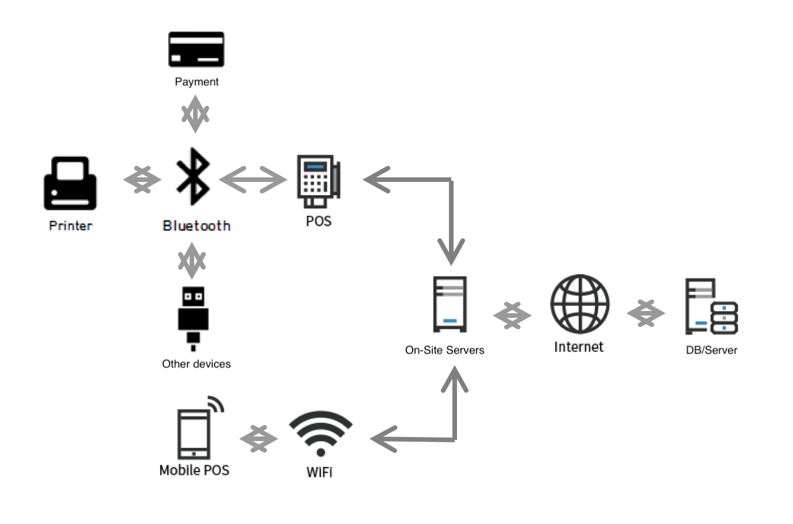

# Play-IOS (즐거운 생활)

## Introduction

Play-IOS is a native IOS Swift application to provide information regarding nearby entertaiment facilities. It uses google Map for  coordinate information and our own database for querying facilities. Information regarding the facilities was provided by the owners and/or korean portal website APIs. This application was published to the App store. Start up company was established ater the App Store upload.

Application uses Excel server to efficiently manage/access establishment information.

## Components

### UI/UX Design

The two major points of the design were accessibility to users and differentiation between paid and unpaid pages. In order to allow advantages to the paid pages, I believed that some degree of accessibility from the unpaid pages should be sacrificed to hightlight those of the paid. 

From left to right, respectively, shows search result view page, upaid store page, and paid store page. Within the search result view page, the difference  between the the paid and unpaid store page is distinct. While the paid store pages are given additional coupon features as well as pictures to stand out from others, The upaid stores are listed in a more rigid fashion. The details within the page also widely vary. The details of the service include from seat descriptions to computer specifications. However, for the unpaid stores the details only include the contact information and the address of the store. The bottom two buttons are trigger buttons for the contacting the store, and for the feature for reserving for a seat in the pc cafe. 

The entirety of the application design is to emphasize these differences, while effectively presenting the neccessary information to the users.

### Core Algorithm

### 

The designed algorithm is shown above. While the actual implementation of the design was limited to the payment server and mobile interation with the database and servers, the product was a working prototype, accepted by the Apple Store.

The process starts with a reservation in the application. When the request is received by the database, it contacts the on-site server with the request. The server on-site makes the seat unavailable for the time-being and waits for the user to login with the provided credentials. When the user logins to use the computer, the reservation status now moves to "in progress" status. The application then updates the UI to manage the current "in progress" reservation, and allows to make further payment to add time. When the use of the computer is finished, it contacts the on-site server again to open up the space on their management system. 

The schedules for the reservation is managed on our database and server, and was under further development to manage numerous conflicts that may occur.

## Prerequisites

* CODE WILL NOT RUN. PLAY-IOS SERVERS AND DATABASE HAS STOPPED RUNNING. 
* Uses Swift 3 and 4. XCode 10.1 to build code.
* Cocoapod installed to computer

## Acknowledgments

* See Podfile

## License

Copyright © 2019 by Seung Yoon Lee
All rights reserved. 

